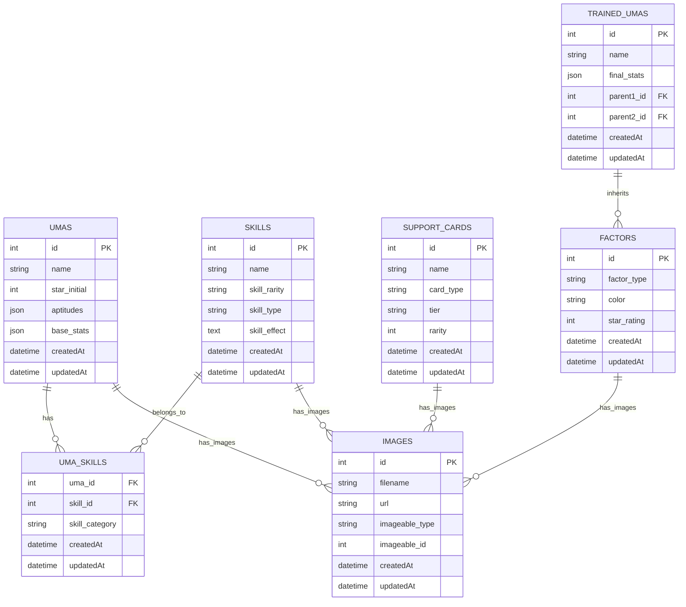

<div align="center">

# ⚙️✨ Uma Musume Notes - Backend API ✨⚙️

<p align="center">
  
  
  
  
</p>

<p align="center">
  <strong>🌟 Backend REST API untuk Uma Musume Notes Database 🌟</strong>
</p>

</div>

---

<div align="center">

## 🌐 Language Selection

<table>
<tr>
<td align="center">
  <a href="#-uma-musume-notes---backend-api-indonesia">
    
  </a>
</td>
<td align="center">
  <a href="#-uma-musume-notes---backend-api-english">
    
  </a>
</td>
<td align="center">
  <a href="#-uma-musume-notes---backend-api-japanese">
    
  </a>
</td>
</tr>
</table>

</div>

---

# ⚙️ Uma Musume Notes - Backend API (Indonesia)

<div align="center">

## 📊 Language Composition

<table>
<tr>
<td align="center">
  
  <br><sub><strong>Primary Language</strong></sub>
</td>
</tr>
</table>

</div>

> **Uma Musume Notes Backend** adalah REST API yang dibangun dengan Node.js dan Express.js untuk menyediakan sistem manajemen data komprehensif untuk game Uma Musume Pretty Derby.

<details>
<summary>📋 <strong>Daftar Isi</strong></summary>

- [🎯 Tujuan](#-tujuan)
- [🛠️ Tech Stack](#️-tech-stack)
- [🏗️ Database Schema](#️-database-schema)
- [✨ Fitur Utama](#-fitur-utama)
- [🚀 Quick Start](#-quick-start)
- [📚 API Documentation](#-api-documentation)
- [🔧 Development Notes](#-development-notes)

</details>

## 🎯 Tujuan

<div align="center">
<table>
<tr>
<td align="center" width="20%">
  
  <br><strong>🗄️ Database Online</strong>
  <br><sub>Sistem penyimpanan terpusat</sub>
</td>
<td align="center" width="20%">
  
  <br><strong>🔌 API Terstruktur</strong>
  <br><sub>REST API skalabel</sub>
</td>
<td align="center" width="20%">
  
  <br><strong>🧬 Sistem Inheritance</strong>
  <br><sub>Breeding & factor management</sub>
</td>
<td align="center" width="20%">
  
  <br><strong>📊 Data Normalisasi</strong>
  <br><sub>Struktur efisien tanpa redundansi</sub>
</td>
<td align="center" width="20%">
  
  <br><strong>🌱 Auto Seeding</strong>
  <br><sub>Populasi data otomatis</sub>
</td>
</tr>
</table>
</div>

## 🛠️ Tech Stack

<div align="center">

### ⚙️ Backend Technologies
<p>
  
  
  
  
  
</p>

### 🔧 Development Tools
<p>
  
  
  
  
</p>

</div>

## 🏗️ Database Schema

<div align="center">

### 📊 ERD Compliant Structure



</div>

<details>
<summary>🗄️ <strong>Database Features</strong></summary>

- **Normalized Tables**: Menghilangkan redundansi data
- **Junction Tables**: Proper many-to-many relationships
- **Self-referencing**: Parent-child relationships untuk breeding
- **Comprehensive Fields**: 16 aptitude types, skill categories, factor colors
- **Polymorphic Relations**: Sistem gambar untuk semua entitas
- **Foreign Keys**: Proper relationship constraints

</details>

## ✨ Fitur Utama

<div align="center">
<table>
<tr>
<td align="center" width="25%">
  <h3>🗄️ Comprehensive Database</h3>
  <ul align="left">
    <li>🐎 <strong>5+ Karakter Uma</strong> dengan 16 aptitude types</li>
    <li>⚡ <strong>Skills Database</strong> dengan rarity system</li>
    <li>🃏 <strong>Support Cards</strong> dengan tier system</li>
    <li>🧬 <strong>Inheritance Factors</strong> dengan color coding</li>
  </ul>
</td>
<td align="center" width="25%">
  <h3>🔄 Smart Auto Seeder</h3>
  <ul align="left">
    <li>🚫 <strong>Duplicate Prevention</strong> tidak duplikat data</li>
    <li>⚙️ <strong>Environment Control</strong> toggle AUTO_SEED</li>
    <li>🎮 <strong>Manual Control</strong> API endpoints kontrol</li>
    <li>✅ <strong>Data Validation</strong> comprehensive field validation</li>
  </ul>
</td>
<td align="center" width="25%">
  <h3>🖼️ Image Management</h3>
  <ul align="left">
    <li>🔗 <strong>Polymorphic Relations</strong> satu sistem untuk semua</li>
    <li>📤 <strong>File Upload</strong> Multer integration</li>
    <li>🌐 <strong>URL Generation</strong> automatic public URLs</li>
    <li>📁 <strong>Multiple Formats</strong> berbagai format gambar</li>
  </ul>
</td>
<td align="center" width="25%">
  <h3>⚡ Production Ready</h3>
  <ul align="left">
    <li>🗄️ <strong>PostgreSQL</strong> database production-grade</li>
    <li>🔍 <strong>Sequelize ORM</strong> advanced query capabilities</li>
    <li>🐳 <strong>Docker Support</strong> containerized deployment</li>
    <li>❌ <strong>Error Handling</strong> robust management</li>
  </ul>
</td>
</tr>
</table>
</div>

## 🚀 Quick Start

### 📋 Prerequisites

<div align="center">
<table>
<tr>
<td align="center">
  
</td>
<td align="center">
  
</td>
<td align="center">
  
</td>
</tr>
</table>
</div>

### ⚡ Installation Steps

<details>
<summary>📥 <strong>1. Clone Repository</strong></summary>

```bash
git clone https://github.com/zakkutsu/uma-notes-be.git
cd uma-notes-be
```

</details>

<details>
<summary>📦 <strong>2. Install Dependencies</strong></summary>

```bash
npm install
```

</details>

<details>
<summary>⚙️ <strong>3. Setup Environment</strong></summary>

Buat file `.env` di root directory:

```env
# Database Configuration
DB_HOST=localhost
DB_PORT=5432
DB_NAME=uma_notes_db
DB_USER=your_username
DB_PASSWORD=your_password

# Server Configuration
PORT=3000
NODE_ENV=development

# Auto Seeding (set to 'true' for automatic seeding on startup)
AUTO_SEED=true

# Production Database (optional)
PROD_DB_HOST=your_prod_host
PROD_DB_NAME=your_prod_db
PROD_DB_USERNAME=your_prod_user
PROD_DB_PASSWORD=your_prod_password
```

</details>

<details>
<summary>🐳 <strong>4. Start Database</strong></summary>

```bash
docker-compose up -d
```

</details>

<details>
<summary>🚀 <strong>5. Run Application</strong></summary>

```bash
# Development mode dengan auto-reload
npm run dev

# Production mode
npm start
# Server akan berjalan di http://localhost:3000
```

</details>

<details>
<summary>✅ <strong>6. Verify Installation</strong></summary>

```bash
curl http://localhost:3000/api/v1/seed
# Should return database statistics
```

</details>

## 📚 API Documentation

<div align="center">

### 🌐 Base URL
`http://localhost:3000/api/v1`

</div>

### 🐎 Umas Endpoints

<div align="center">
<table>
<tr>
<th>Method</th>
<th>Endpoint</th>
<th>Description</th>
<th>Auth</th>
</tr>
<tr>
<td></td>
<td><code>/umas</code></td>
<td>List semua karakter Uma Musume</td>
<td>❌</td>
</tr>
<tr>
<td></td>
<td><code>/umas/:id</code></td>
<td>Detail karakter dengan skills & associations</td>
<td>❌</td>
</tr>
<tr>
<td></td>
<td><code>/umas</code></td>
<td>Create new uma (with image upload)</td>
<td>❌</td>
</tr>
<tr>
<td></td>
<td><code>/umas/:id</code></td>
<td>Update uma (with image upload)</td>
<td>❌</td>
</tr>
<tr>
<td></td>
<td><code>/umas/:id</code></td>
<td>Delete uma</td>
<td>❌</td>
</tr>
</table>
</div>

### ⚡ Skills Endpoints

<div align="center">
<table>
<tr>
<th>Method</th>
<th>Endpoint</th>
<th>Description</th>
<th>Auth</th>
</tr>
<tr>
<td></td>
<td><code>/skills</code></td>
<td>Database terpusat semua skill</td>
<td>❌</td>
</tr>
<tr>
<td></td>
<td><code>/skills/:id</code></td>
<td>Detail skill dengan rarity & type</td>
<td>❌</td>
</tr>
<tr>
<td></td>
<td><code>/skills</code></td>
<td>Create new skill (with image upload)</td>
<td>❌</td>
</tr>
<tr>
<td></td>
<td><code>/skills/:id</code></td>
<td>Update skill (with image upload)</td>
<td>❌</td>
</tr>
<tr>
<td></td>
<td><code>/skills/:id</code></td>
<td>Delete skill</td>
<td>❌</td>
</tr>
</table>
</div>

### 🃏 Support Cards & 🧬 Factors Endpoints

<div align="center">
<table>
<tr>
<th>Method</th>
<th>Endpoint</th>
<th>Description</th>
<th>Auth</th>
</tr>
<tr>
<td></td>
<td><code>/support-cards</code></td>
<td>List semua support card</td>
<td>❌</td>
</tr>
<tr>
<td></td>
<td><code>/support-cards/:id</code></td>
<td>Detail card dengan skills yang diberikan</td>
<td>❌</td>
</tr>
<tr>
<td></td>
<td><code>/factors</code></td>
<td>List inheritance factors</td>
<td>❌</td>
</tr>
<tr>
<td></td>
<td><code>/factors/:id</code></td>
<td>Detail factor dengan color & star rating</td>
<td>❌</td>
</tr>
<tr>
<td></td>
<td><code>/trained-umas</code></td>
<td>List semua trained umas</td>
<td>❌</td>
</tr>
<tr>
<td></td>
<td><code>/trained-umas/:id</code></td>
<td>Detail trained uma</td>
<td>❌</td>
</tr>
</table>
</div>

### 🌱 Seeder Control Endpoints

<div align="center">
<table>
<tr>
<th>Method</th>
<th>Endpoint</th>
<th>Description</th>
<th>Auth</th>
</tr>
<tr>
<td></td>
<td><code>/seed</code></td>
<td>Status seeding & statistik data</td>
<td>❌</td>
</tr>
<tr>
<td></td>
<td><code>/seed/run</code></td>
<td>Manual trigger seeding</td>
<td>❌</td>
</tr>
<tr>
<td></td>
<td><code>/seed/clear</code></td>
<td>Clear all seeded data</td>
<td>❌</td>
</tr>
<tr>
<td></td>
<td><code>/seed/reset</code></td>
<td>Reset & re-seed database</td>
<td>❌</td>
</tr>
</table>
</div>

<details>
<summary>📊 <strong>API Response Example</strong></summary>

```json
{
  "meta": {
    "code": 200,
    "status": "Data Uma berhasil diambil",
    "message": true,
    "isPaginated": true
  },
  "pagination": {
    "currentPage": 1,
    "totalPages": 3,
    "totalRows": 25,
    "limit": 10,
    "hasNextPage": true,
    "hasPrevPage": false,
    "showing": "1-10 of 25 items"
  },
  "data": {
    "id": 1,
    "name": "Special Week",
    "speed_aptitude": "A",
    "stamina_aptitude": "B",
    "images": [
      {
        "url": "http://localhost:3000/uploads/umas/placeholder-special-week.jpg"
      }
    ]
  }
}
```

</details>

<details>
<summary>💻 <strong>Example Requests</strong></summary>

```bash
# Get all Uma characters
curl http://localhost:3000/api/v1/umas

# Get specific Uma with details  
curl http://localhost:3000/api/v1/umas/1

# Create new uma
curl -X POST http://localhost:3000/api/v1/umas \
  -H "Content-Type: application/json" \
  -d '{
    "name": "Rice Shower",
    "star_initial": 3,
    "speed_aptitude": "A",
    "stamina_aptitude": "A",
    "power_aptitude": "B"
  }'

# Check seeder status
curl http://localhost:3000/api/v1/seed

# Manual seeding
curl -X POST http://localhost:3000/api/v1/seed/run
```

</details>

## 📱 Demo & Testing

### 🌐 Live API Testing

<div align="center">
<table>
<tr>
<td align="center" width="33%">
  <strong>📮 Postman</strong><br/>
  <sub>Comprehensive API testing</sub>
</td>
<td align="center" width="33%">
  <strong>🌐 Browser</strong><br/>
  <sub>GET endpoints testing</sub>
</td>
<td align="center" width="33%">
  <strong>⚡ curl</strong><br/>
  <sub>Command line testing</sub>
</td>
</tr>
</table>
</div>

### 📊 Database Statistics

Setelah seeding sukses, database akan berisi:

<div align="center">
<table>
<tr>
<td align="center">
  <strong>🐎 5 Uma Characters</strong><br/>
  <sub>Special Week, Silence Suzuka, Tokai Teio, Vodka, Daiwa Scarlet</sub>
</td>
<td align="center">
  <strong>⚡ 10 Skills</strong><br/>
  <sub>Concentration, Pace Up, Positioning, Stamina Keeper, dll</sub>
</td>
</tr>
<tr>
<td align="center">
  <strong>🧬 10 Factors</strong><br/>
  <sub>Speed factors, Stamina factors, Distance factors, dll</sub>
</td>
<td align="center">
  <strong>🃏 12 Support Cards</strong><br/>
  <sub>Various SSR, SR, dan R cards</sub>
</td>
</tr>
</table>
</div>

## 🔧 Development Notes

<details>
<summary>📁 <strong>Project Structure</strong></summary>

```
📁 uma-notes-be/
├── 📄 app.js                 # Main application entry (legacy)
├── 📄 index.js               # Current application entry point
├── 📄 package.json           # Dependencies dan scripts
├── 📄 docker-compose.yml     # PostgreSQL container setup
├── 📁 config/               # Database configuration
├── 📁 controllers/          # Route handlers
├── 📁 models/               # Sequelize models
├── 📁 routes/               # API route definitions
├── 📁 services/             # Business logic layer
├── 📁 helpers/              # Utility functions
├── 📁 middlewares/          # Custom middlewares
├── 📁 seeders/              # Database seeding
└── 📁 public/uploads/       # File upload storage
```

</details>

## 🎮 Features Overview

<div align="center">
<table>
<tr>
<th>✅ Core Features</th>
<th>🔧 Technical Features</th>
<th>👨‍💻 Developer Experience</th>
</tr>
<tr>
<td>
  ✅ Uma Database (5+ karakter)<br/>
  ✅ Skills System (9 categories)<br/>
  ✅ Support Cards (tier system)<br/>
  ✅ Inheritance System<br/>
  ✅ Factor Management<br/>
  ✅ Image Upload System
</td>
<td>
  ✅ RESTful API<br/>
  ✅ Data Validation<br/>
  ✅ Auto Migration<br/>
  ✅ Seeder System<br/>
  ✅ Error Handling<br/>
  ✅ Pagination Support
</td>
<td>
  ✅ Environment Config<br/>
  ✅ Docker Support<br/>
  ✅ API Documentation<br/>
  ✅ Code Structure<br/>
  ✅ Hot Reload<br/>
  ✅ File Upload
</td>
</tr>
</table>
</div>

## 🏷️ Tags

<div align="center">
<p>
  
  
  
  
</p>
<p>
  
  
  
  
</p>
<p>
  
  
  
</p>
<p>
  
  
  
  
</p>
</div>

## 🔗 Related Repositories

<div align="center">
<table>
<tr>
<td align="center">
  <a href="https://github.com/zakkutsu/uma-notes-fe.git">
    
  </a>
  <br><sub>Frontend dengan React + TypeScript</sub>
</td>
<td align="center">
  <a href="https://github.com/zakkutsu/uma-notes.git">
    
  </a>
  <br><sub>Project documentation & overview</sub>
</td>
</tr>
</table>
</div>

---

<div align="center">

**🎉 Happy Coding! 🏇✨**

</div>

---

# ⚙️ Uma Musume Notes - Backend API (English)

<div align="center">

## 📊 Language Composition

<table>
<tr>
<td align="center">
  
  <br><sub><strong>Primary Language</strong></sub>
</td>
</tr>
</table>

</div>

> **Uma Musume Notes Backend** is a REST API built with Node.js and Express.js to provide a comprehensive data management system for the Uma Musume Pretty Derby game.

<details>
<summary>📋 <strong>Table of Contents</strong></summary>

- [🎯 Objectives](#-objectives-1)
- [🛠️ Tech Stack](#️-tech-stack-1)
- [🏗️ Database Schema](#️-database-schema-1)
- [✨ Key Features](#-key-features-1)
- [🚀 Quick Start](#-quick-start-1)
- [📚 API Documentation](#-api-documentation-1)
- [🔧 Development Notes](#-development-notes-1)

</details>

## 🎯 Objectives

<div align="center">
<table>
<tr>
<td align="center" width="20%">
  
  <br><strong>🗄️ Online Database</strong>
  <br><sub>Centralized storage system</sub>
</td>
<td align="center" width="20%">
  
  <br><strong>🔌 Structured API</strong>
  <br><sub>Scalable REST API</sub>
</td>
<td align="center" width="20%">
  
  <br><strong>🧬 Inheritance System</strong>
  <br><sub>Breeding & factor management</sub>
</td>
<td align="center" width="20%">
  
  <br><strong>📊 Data Normalization</strong>
  <br><sub>Efficient structure without redundancy</sub>
</td>
<td align="center" width="20%">
  
  <br><strong>🌱 Auto Seeding</strong>
  <br><sub>Automatic data population</sub>
</td>
</tr>
</table>
</div>

## 🛠️ Tech Stack

<div align="center">

### ⚙️ Backend Technologies
<p>
  
  
  
  
  
</p>

### 🔧 Development Tools
<p>
  
  
  
  
</p>

</div>

## 🏗️ Database Schema

<div align="center">

### 📊 ERD Compliant Structure


</div>

<details>
<summary>🗄️ <strong>Database Features</strong></summary>

- **Normalized Tables**: Eliminate data redundancy
- **Junction Tables**: Proper many-to-many relationships
- **Self-referencing**: Parent-child relationships for breeding
- **Comprehensive Fields**: 16 aptitude types, skill categories, factor colors
- **Polymorphic Relations**: Image system for all entities
- **Foreign Keys**: Proper relationship constraints

</details>

## ✨ Key Features

<div align="center">
<table>
<tr>
<td align="center" width="25%">
  <h3>🗄️ Comprehensive Database</h3>
  <ul align="left">
    <li>🐎 <strong>5+ Uma Characters</strong> with 16 aptitude types</li>
    <li>⚡ <strong>Skills Database</strong> with rarity system</li>
    <li>🃏 <strong>Support Cards</strong> with tier system</li>
    <li>🧬 <strong>Inheritance Factors</strong> with color coding</li>
  </ul>
</td>
<td align="center" width="25%">
  <h3>🔄 Smart Auto Seeder</h3>
  <ul align="left">
    <li>🚫 <strong>Duplicate Prevention</strong> no duplicate data</li>
    <li>⚙️ <strong>Environment Control</strong> toggle AUTO_SEED</li>
    <li>🎮 <strong>Manual Control</strong> API endpoints control</li>
    <li>✅ <strong>Data Validation</strong> comprehensive field validation</li>
  </ul>
</td>
<td align="center" width="25%">
  <h3>🖼️ Image Management</h3>
  <ul align="left">
    <li>🔗 <strong>Polymorphic Relations</strong> one system for all</li>
    <li>📤 <strong>File Upload</strong> Multer integration</li>
    <li>🌐 <strong>URL Generation</strong> automatic public URLs</li>
    <li>📁 <strong>Multiple Formats</strong> various image formats</li>
  </ul>
</td>
<td align="center" width="25%">
  <h3>⚡ Production Ready</h3>
  <ul align="left">
    <li>🗄️ <strong>PostgreSQL</strong> production-grade database</li>
    <li>🔍 <strong>Sequelize ORM</strong> advanced query capabilities</li>
    <li>🐳 <strong>Docker Support</strong> containerized deployment</li>
    <li>❌ <strong>Error Handling</strong> robust management</li>
  </ul>
</td>
</tr>
</table>
</div>

## 🚀 Quick Start

### 📋 Prerequisites

<div align="center">
<table>
<tr>
<td align="center">
  
</td>
<td align="center">
  
</td>
<td align="center">
  
</td>
</tr>
</table>
</div>

### ⚡ Installation Steps

<details>
<summary>📥 <strong>1. Clone Repository</strong></summary>

```bash
git clone https://github.com/zakkutsu/uma-notes-be.git
cd uma-notes-be
```

</details>

<details>
<summary>📦 <strong>2. Install Dependencies</strong></summary>

```bash
npm install
```

</details>

<details>
<summary>⚙️ <strong>3. Setup Environment</strong></summary>

Create `.env` file in root directory:

```env
# Database Configuration
DB_HOST=localhost
DB_PORT=5432
DB_NAME=uma_notes_db
DB_USER=your_username
DB_PASSWORD=your_password

# Server Configuration
PORT=3000
NODE_ENV=development

# Auto Seeding (set to 'true' for automatic seeding on startup)
AUTO_SEED=true

# Production Database (optional)
PROD_DB_HOST=your_prod_host
PROD_DB_NAME=your_prod_db
PROD_DB_USERNAME=your_prod_user
PROD_DB_PASSWORD=your_prod_password
```

</details>

<details>
<summary>🐳 <strong>4. Start Database</strong></summary>

```bash
docker-compose up -d
```

</details>

<details>
<summary>🚀 <strong>5. Run Application</strong></summary>

```bash
# Development mode with auto-reload
npm run dev

# Production mode
npm start
# Server will run at http://localhost:3000
```

</details>

<details>
<summary>✅ <strong>6. Verify Installation</strong></summary>

```bash
curl http://localhost:3000/api/v1/seed
# Should return database statistics
```

</details>

## 📚 API Documentation

<div align="center">

### 🌐 Base URL
`http://localhost:3000/api/v1`

</div>

### 🐎 Umas Endpoints

<div align="center">
<table>
<tr>
<th>Method</th>
<th>Endpoint</th>
<th>Description</th>
<th>Auth</th>
</tr>
<tr>
<td></td>
<td><code>/umas</code></td>
<td>List all Uma Musume characters</td>
<td>❌</td>
</tr>
<tr>
<td></td>
<td><code>/umas/:id</code></td>
<td>Character details with skills & associations</td>
<td>❌</td>
</tr>
<tr>
<td></td>
<td><code>/umas</code></td>
<td>Create new uma (with image upload)</td>
<td>❌</td>
</tr>
<tr>
<td></td>
<td><code>/umas/:id</code></td>
<td>Update uma (with image upload)</td>
<td>❌</td>
</tr>
<tr>
<td></td>
<td><code>/umas/:id</code></td>
<td>Delete uma</td>
<td>❌</td>
</tr>
</table>
</div>

### ⚡ Skills Endpoints

<div align="center">
<table>
<tr>
<th>Method</th>
<th>Endpoint</th>
<th>Description</th>
<th>Auth</th>
</tr>
<tr>
<td></td>
<td><code>/skills</code></td>
<td>Centralized database of all skills</td>
<td>❌</td>
</tr>
<tr>
<td></td>
<td><code>/skills/:id</code></td>
<td>Skill details with rarity & type</td>
<td>❌</td>
</tr>
<tr>
<td></td>
<td><code>/skills</code></td>
<td>Create new skill (with image upload)</td>
<td>❌</td>
</tr>
<tr>
<td></td>
<td><code>/skills/:id</code></td>
<td>Update skill (with image upload)</td>
<td>❌</td>
</tr>
<tr>
<td></td>
<td><code>/skills/:id</code></td>
<td>Delete skill</td>
<td>❌</td>
</tr>
</table>
</div>

### 🃏 Support Cards & 🧬 Factors Endpoints

<div align="center">
<table>
<tr>
<th>Method</th>
<th>Endpoint</th>
<th>Description</th>
<th>Auth</th>
</tr>
<tr>
<td></td>
<td><code>/support-cards</code></td>
<td>List all support cards</td>
<td>❌</td>
</tr>
<tr>
<td></td>
<td><code>/support-cards/:id</code></td>
<td>Card details with provided skills</td>
<td>❌</td>
</tr>
<tr>
<td></td>
<td><code>/factors</code></td>
<td>List inheritance factors</td>
<td>❌</td>
</tr>
<tr>
<td></td>
<td><code>/factors/:id</code></td>
<td>Factor details with color & star rating</td>
<td>❌</td>
</tr>
<tr>
<td></td>
<td><code>/trained-umas</code></td>
<td>List all trained umas</td>
<td>❌</td>
</tr>
<tr>
<td></td>
<td><code>/trained-umas/:id</code></td>
<td>Trained uma details</td>
<td>❌</td>
</tr>
</table>
</div>

### 🌱 Seeder Control Endpoints

<div align="center">
<table>
<tr>
<th>Method</th>
<th>Endpoint</th>
<th>Description</th>
<th>Auth</th>
</tr>
<tr>
<td></td>
<td><code>/seed</code></td>
<td>Seeding status & data statistics</td>
<td>❌</td>
</tr>
<tr>
<td></td>
<td><code>/seed/run</code></td>
<td>Manual trigger seeding</td>
<td>❌</td>
</tr>
<tr>
<td></td>
<td><code>/seed/clear</code></td>
<td>Clear all seeded data</td>
<td>❌</td>
</tr>
<tr>
<td></td>
<td><code>/seed/reset</code></td>
<td>Reset & re-seed database</td>
<td>❌</td>
</tr>
</table>
</div>

## 📱 Demo & Testing

### 🌐 Live API Testing

<div align="center">
<table>
<tr>
<td align="center" width="33%">
  <strong>📮 Postman</strong><br/>
  <sub>Comprehensive API testing</sub>
</td>
<td align="center" width="33%">
  <strong>🌐 Browser</strong><br/>
  <sub>GET endpoints testing</sub>
</td>
<td align="center" width="33%">
  <strong>⚡ curl</strong><br/>
  <sub>Command line testing</sub>
</td>
</tr>
</table>
</div>

### 📊 Database Statistics

After successful seeding, the database will contain:

<div align="center">
<table>
<tr>
<td align="center">
  <strong>🐎 5 Uma Characters</strong><br/>
  <sub>Special Week, Silence Suzuka, Tokai Teio, Vodka, Daiwa Scarlet</sub>
</td>
<td align="center">
  <strong>⚡ 10 Skills</strong><br/>
  <sub>Concentration, Pace Up, Positioning, Stamina Keeper, etc.</sub>
</td>
</tr>
<tr>
<td align="center">
  <strong>🧬 10 Factors</strong><br/>
  <sub>Speed factors, Stamina factors, Distance factors, etc.</sub>
</td>
<td align="center">
  <strong>🃏 12 Support Cards</strong><br/>
  <sub>Various SSR, SR, and R cards</sub>
</td>
</tr>
</table>
</div>

## 🔗 Related Repositories

<div align="center">
<table>
<tr>
<td align="center">
  <a href="https://github.com/zakkutsu/uma-notes-fe.git">
    
  </a>
  <br><sub>Frontend with React + TypeScript</sub>
</td>
<td align="center">
  <a href="https://github.com/zakkutsu/uma-notes.git">
    
  </a>
  <br><sub>Project documentation & overview</sub>
</td>
</tr>
</table>
</div>

---

<div align="center">

**🎉 Happy Coding! 🏇✨**

</div>

---

# ⚙️ Uma Musume Notes - Backend API (Japanese)

<div align="center">

## 📊 言語構成

<table>
<tr>
<td align="center">
  
  <br><sub><strong>主要言語</strong></sub>
</td>
</tr>
</table>

</div>

> **Uma Musume Notes Backend** は、Node.jsとExpress.jsで構築されたREST APIで、ウマ娘 プリティーダービーゲーム用の包括的なデータ管理システムを提供します。

<details>
<summary>📋 <strong>目次</strong></summary>

- [🎯 目標](#-目標-1)
- [🛠️ 技術スタック](#️-技術スタック-1)
- [🏗️ データベーススキーマ](#️-データベーススキーマ-1)
- [✨ 主な機能](#-主な機能-1)
- [🚀 クイックスタート](#-クイックスタート-1)
- [📚 API ドキュメント](#-api-ドキュメント)
- [🔧 開発ノート](#-開発ノート)

</details>

## 🎯 目標

<div align="center">
<table>
<tr>
<td align="center" width="20%">
  
  <br><strong>🗄️ オンラインデータベース</strong>
  <br><sub>集中ストレージシステム</sub>
</td>
<td align="center" width="20%">
  
  <br><strong>🔌 構造化API</strong>
  <br><sub>スケーラブルなREST API</sub>
</td>
<td align="center" width="20%">
  
  <br><strong>🧬 継承システム</strong>
  <br><sub>ブリーディング & ファクター管理</sub>
</td>
<td align="center" width="20%">
  
  <br><strong>📊 データ正規化</strong>
  <br><sub>冗長性のない効率的な構造</sub>
</td>
<td align="center" width="20%">
  
  <br><strong>🌱 自動シーディング</strong>
  <br><sub>自動データ投入</sub>
</td>
</tr>
</table>
</div>

## 🛠️ 技術スタック

<div align="center">

### ⚙️ バックエンド技術
<p>
  
  
  
  
  
</p>

### 🔧 開発ツール
<p>
  
  
  
  
</p>

</div>

## 🏗️ データベーススキーマ

<div align="center">

### 📊 ERD準拠構造


</div>

<details>
<summary>🗄️ <strong>データベース機能</strong></summary>

- **正規化テーブル**: データの冗長性を排除
- **ジャンクションテーブル**: 適切な多対多関係
- **自己参照**: ブリーディング用の親子関係
- **包括的フィールド**: 16適性タイプ、スキルカテゴリ、ファクターカラー
- **ポリモーフィック関係**: 全エンティティ用画像システム
- **外部キー**: 適切な関係制約

</details>

## ✨ 主な機能

<div align="center">
<table>
<tr>
<td align="center" width="25%">
  <h3>🗄️ 包括的データベース</h3>
  <ul align="left">
    <li>🐎 <strong>5+ウマ娘キャラクター</strong> 16適性タイプ付き</li>
    <li>⚡ <strong>スキルデータベース</strong> レアリティシステム付き</li>
    <li>🃏 <strong>サポートカード</strong> ティアシステム付き</li>
    <li>🧬 <strong>継承ファクター</strong> カ
